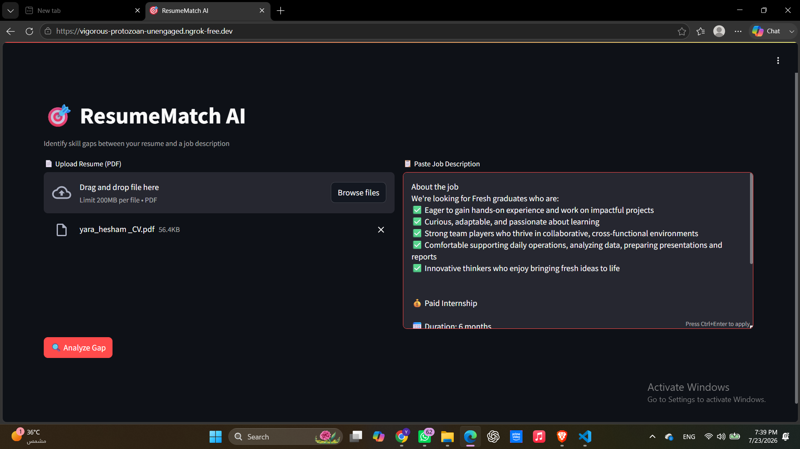
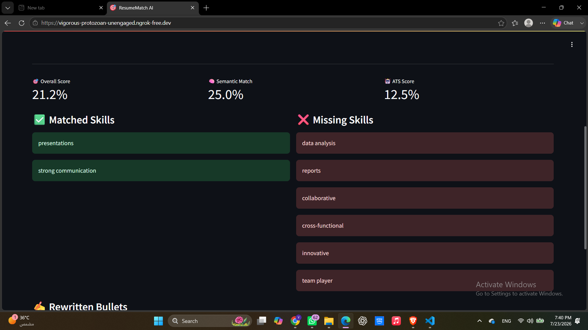
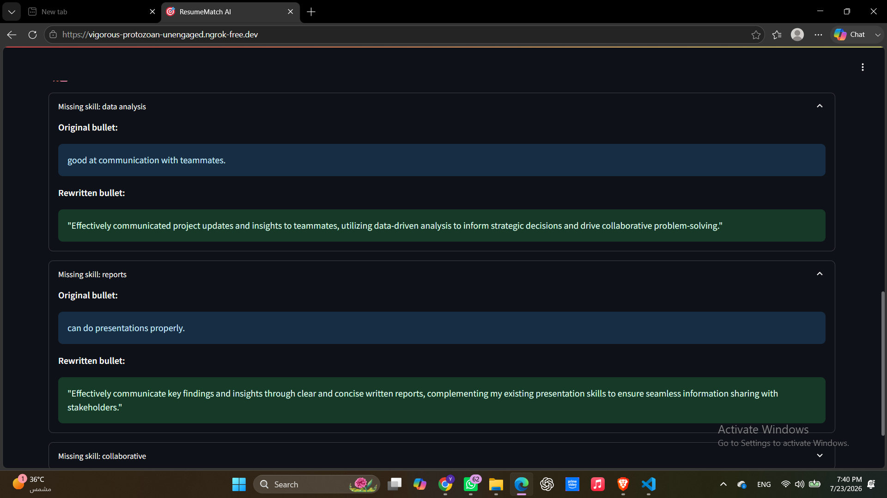

# 🚀 [Tips Hindawi](https://www.tipshindawi.com/) Challenge (June–July) 2026

> 🏆 This repository is my official submission for the [**Tips Hindawi**](https://www.tipshindawi.com/) **Challenge (June–July) 2026**.

## 👤 Participant

| Field            | Value                                |
| ---------------- | ------------------------------------ |
| Full Name        | Yara Hesham                          |
| Project Name     | ResumeMatch AI                       |
| GitHub Username  | yarah0003         |
| Challenge Batch  | June–July 2026                       |
| Training Program | Large Language Models (LLMs) Program |
| Organization     | [**Edrak for Ai**](https://edrak4ai.com/en) |

---

# 📖 Project Overview

Job seekers often apply to postings without knowing which skills or keywords are missing from their resume. Generic advice like "tailor your resume" isn't actionable.

**ResumeMatch AI** is a Job Description ↔ Resume Gap Analyzer powered by RAG, LangChain chains, and Llama 3.1 8B via the Groq API. It identifies missing skills, computes a match score, and automatically rewrites weak resume bullets into strong, quantified ones — grounded in a real skill taxonomy and strong bullet examples via retrieval-augmented generation.

---

# ✨ Features

* **Skill Gap Detection** — extracts skills from both resume and job description, then semantically matches them (local `all-MiniLM-L6-v2` embeddings via HuggingFace + cosine similarity) to surface what's missing
* **Match Score** — produces a structured, quantified score instead of vague "tailor your resume" advice
* **RAG-Grounded Extraction** — two Chroma vector stores ground the pipeline: one on the O*NET skill taxonomy (what counts as a valid skill), one on curated strong bullet examples (few-shot rewriting context)
* **Structured Output** — every LLM call is enforced through Pydantic output parsers (`ExtractionResult`, `GapReport`, `RewrittenBullet`), so the UI always gets consistent, typed data
* **Bullet Rewriter (Extra Feature, beyond syllabus)** — for each missing skill, finds the candidate's closest existing bullet by similarity, retrieves 3 strong examples from the curated store, and rewrites the weak bullet with Llama 3.1 8B (Groq)
* **Streamlit Dashboard** — two-column layout for PDF upload + JD paste, with live score metrics and matched/missing skill breakdown
* **Live Public Demo** — served via ngrok, no cloud deployment needed

---

# 🛠️ Technologies Used

| Component     | Tool                              |
| -------------- | ---------------------------------- |
| LLM            | Llama 3.1 8B (via Groq API)        |
| Framework      | LangChain 0.2 (chains + output parsers) |
| Vector Store   | Chroma (persistent, local)         |
| Embeddings     | all-MiniLM-L6-v2 (HuggingFace, local, free) |
| PDF Parsing    | pdfplumber                         |
| UI             | Streamlit                          |
| Demo           | ngrok                              |
| Language       | Python 3.11                        |

**Course concepts applied:**
- **RAG** — dual Chroma vector stores for skill grounding and few-shot bullet rewriting
- **LangChain Chains** — composable `PromptTemplate | LLM | OutputParser` pipeline (parse → extract → match → rewrite → format)
- **Output Parsers** — `PydanticOutputParser` enforces structured JSON from every LLM call
- **Streamlit** — interactive dashboard for live scoring and results
- **ngrok** — public demo URL for presentation without deployment

---

# ⚙️ Installation

```bash
# 1. Clone/download the project
cd resumematch_ai

# 2. Create and activate virtual environment
python -m venv venv
venv\Scripts\activate        # Windows
# source venv/bin/activate   # Mac/Linux

# 3. Install dependencies
pip install -r requirements.txt

# 4. Add API keys to .env
GROQ_API_KEY=gsk_...
NGROK_AUTHTOKEN=...
```

---

# 🚀 Usage

**Quick test (no UI):**
```bash
python test_run.py
```

**Streamlit UI (local):**
```bash
streamlit run app.py
```
→ Opens at `http://localhost:8501`

**Public demo via ngrok:**
```bash
python ngrok_run.py
```
→ Prints a public URL you can share

**Project structure:**
```
resumematch_ai/
├── pipeline/
│   ├── parser.py          # PDF text extraction
│   ├── extractor.py       # LangChain skill extraction chain
│   ├── rag_setup.py       # Chroma vector store builder
│   ├── matcher.py         # Semantic skill matching + ATS score
│   ├── rewriter.py        # RAG few-shot bullet rewriter
│   ├── output_schema.py   # Pydantic output models
│   └── orchestrator.py    # Main pipeline runner
├── data/
│   ├── skills.csv         # O*NET skill taxonomy
│   └── bullet_examples.json
├── vector_store/          # Chroma persisted databases
├── app.py                 # Streamlit UI
├── ngrok_run.py           # Public demo launcher
├── requirements.txt
└── .env                   # API keys (not committed)
```

---

# 📸 Demo





---

# 📈 Results

Tested on 5 resume/JD pairs. Manual evaluation focused on:
- Did it correctly identify obviously missing skills?
- Did rewritten bullets sound natural and accurate (not hallucinated)?

**Summary:**
- Missing skills correctly identified in **5/5** pairs
- Rewritten bullets rated natural and accurate (not hallucinated) in **4/5** pairs
-  the missing skills worked well in every attempt as well as the rewritten bullets. 

**Data sources used for evaluation:**
- Skill Taxonomy: [O*NET Database](https://www.onetcenter.org/db_releases.html) (US Dept. of Labor)
- Bullet Examples: Manually curated from Harvard OCS Resume Guide and Indeed Career Blog (paraphrased, not reproduced verbatim)
- Test Data: Own resume + real job postings from LinkedIn/Indeed

---

# 🔮 Future Improvements

* Tune the 0.72 cosine similarity threshold per domain
* Expand and improve the curated bullet example set (rewriter quality depends on it)
* Add streaming so analysis doesn't take ~30–60s per run
* Add ESCO taxonomy support for the EU job market
* Add multi-language support

---

# 📚 About the Challenge

This project was developed as part of the [**Tips Hindawi**](https://www.tipshindawi.com/) **Challenge (June–July) 2026**.

[Tips Hindawi](https://www.tipshindawi.com/) is the internships department of [**Edrak for Ai**](https://edrak4ai.com/en), and the challenge encourages participants to build real-world projects, apply practical skills, and showcase their work through GitHub.

For more information about the challenge, training programs, and upcoming batches, visit the official [Tips Hindawi](https://www.tipshindawi.com/) website.

---

# 📄 License

This project is shared for educational and portfolio purposes.